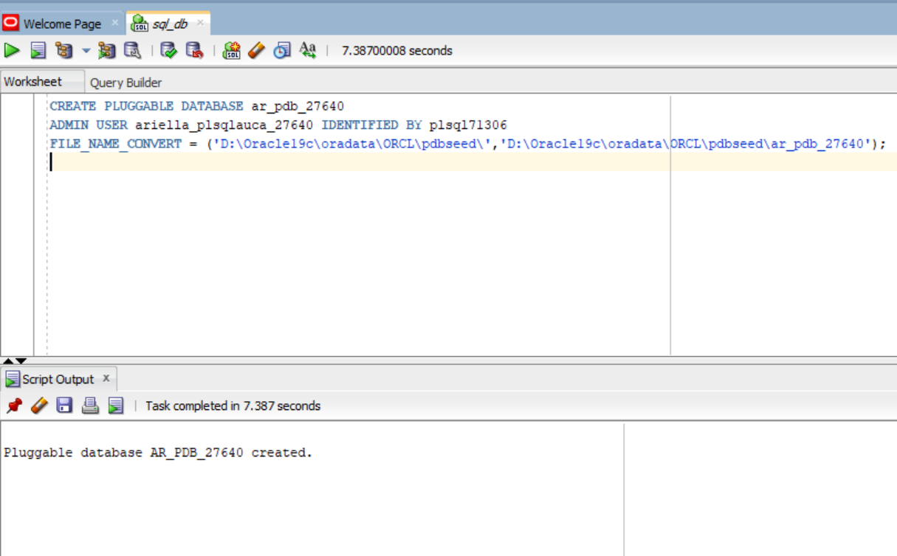
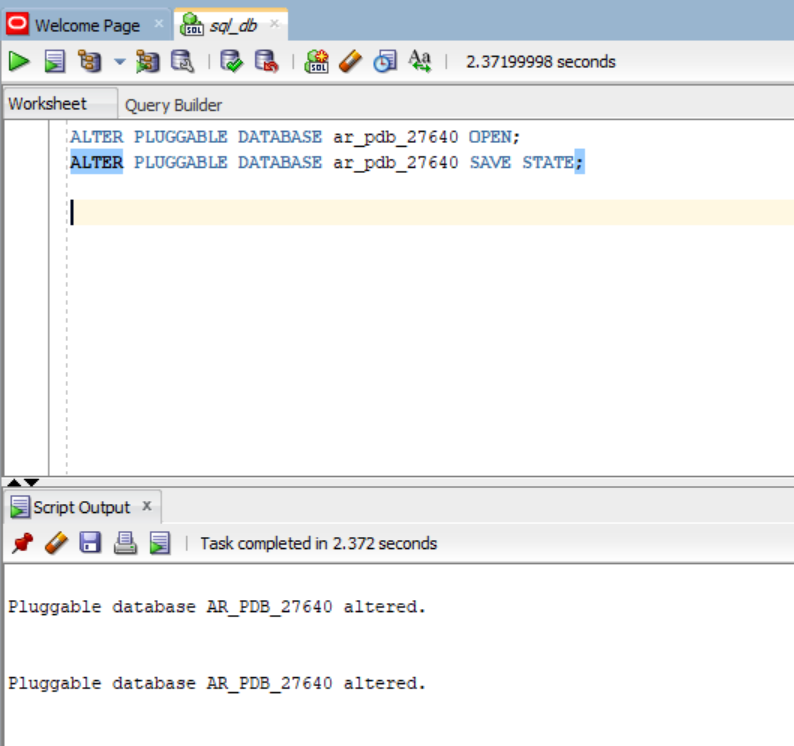
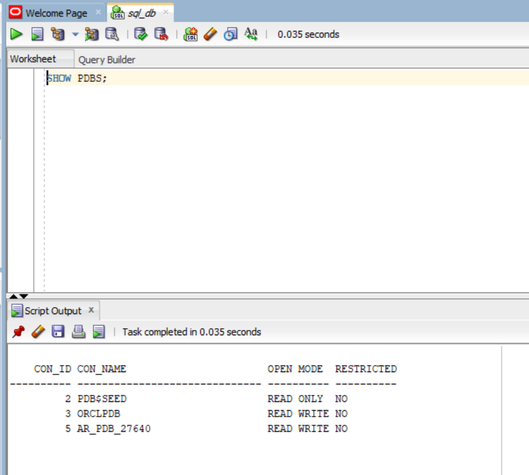
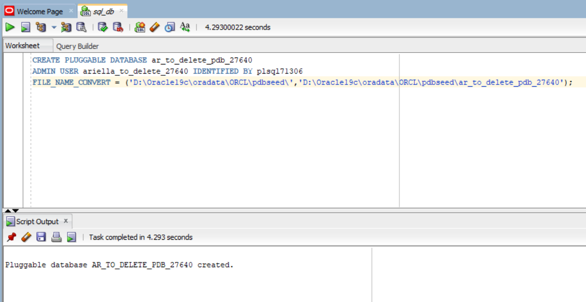
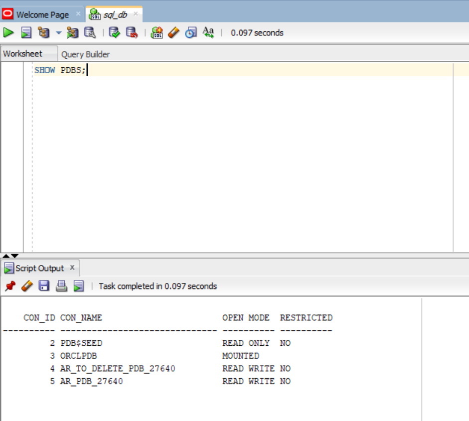
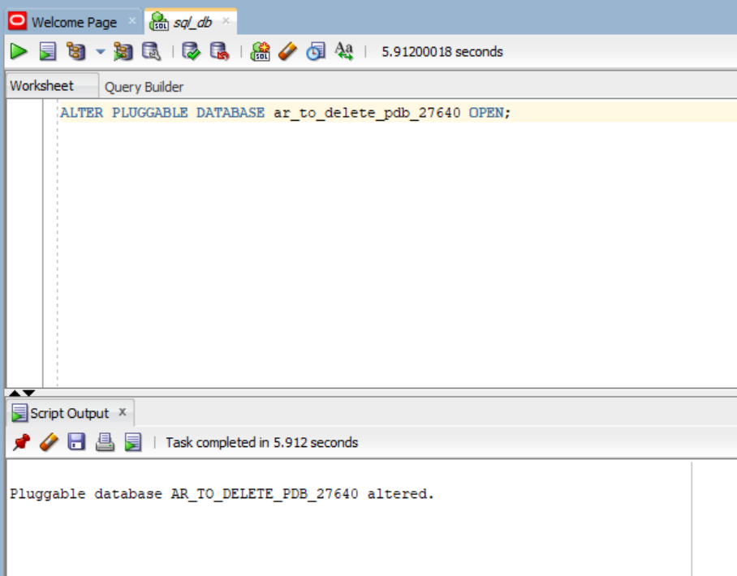
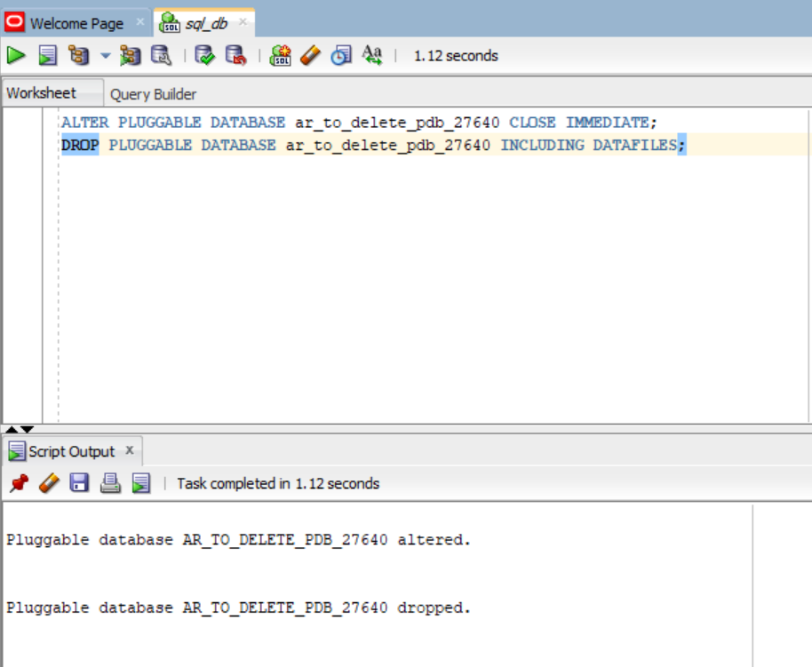
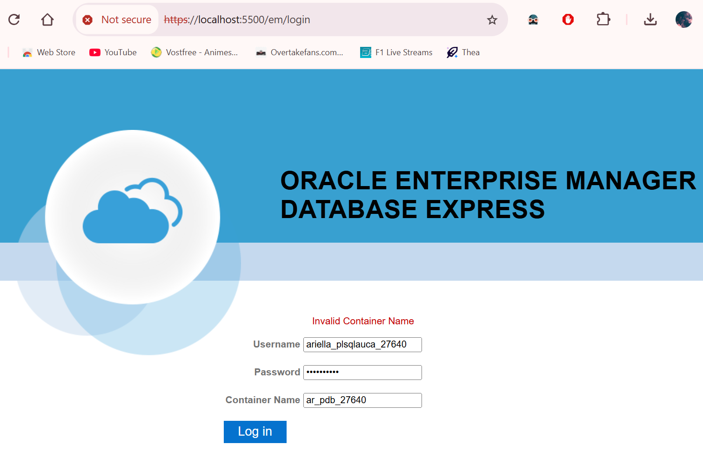

# PL/SQL Assignment 2 Report: Creating Pluggable Databases   
**Names:** RUREBWAYIRE AMPOZE Ariella  
**Student ID:** 27640  


---

## 🧩 Task 1: Create a New Pluggable Database (PDB)

### **Objective**
Create a new Pluggable Database that will store all class work.

### **Steps Performed**
1. Connected to Oracle SQL Developer using **SYS as SYSDBA**.  
2. Created a new PDB named **ar_pdb_27640**:
   ```sql
   CREATE PLUGGABLE DATABASE ar_pdb_27640
   ADMIN USER ariella_plsqlauca_27640 IDENTIFIED BY plsql71306
   FILE_NAME_CONVERT = ('D:\Oracle19c\oradata\ORCL\pdbseed\','D:\Oracle19c\oradata\ORCL\pdbseed\ar_pdb_27640');
   ```
   
    📸 Screenshot:

     

   
4. Opened the PDB and saved its state:
   ```sql
   ALTER PLUGGABLE DATABASE ar_pdb_27640 OPEN;
   ALTER PLUGGABLE DATABASE ar_pdb_27640 SAVE STATE;
   ```

     📸 Screenshot:

   

   
6. Verified it was active:
   ```sql
   SHOW PDBS;
   ```
  📸 Screenshot:

  

  
### **Observation**
Initial connection attempts failed due to `ORA-01017: invalid username/password; logon denied`.  
This was resolved by ensuring the connection was directed to the **PDB service name** (`ar_pdb_27640`) instead of the default **SID** `orcl`.

---

## 🧩 Task 2: Create and Delete a PDB

### **Objective**
Create a secondary PDB and delete it after verifying successful creation.

### **Steps Performed**
1. Connected again as **SYS AS SYSDBA**.
2. Created another PDB:
   ```sql
   CREATE PLUGGABLE DATABASE ar_to_delete_pdb_27640
   ADMIN USER ariella_to_delete_27640 IDENTIFIED BY plsql71306
   FILE_NAME_CONVERT = ('pdbseed', 'ar_to_delete_pdb_27640');
   ```

     📸 Screenshot:

   

   
3. Verified the new PDB was created:
   ```sql
   SHOW PDBS;
   ```

     📸 Screenshot:

      

   
5. Opened it to test accessibility:
   ```sql
   ALTER PLUGGABLE DATABASE ar_to_delete_pdb_27640 OPEN;
   ```

  
     📸 Screenshot:

      

    
6. Then closed and dropped it:
   ```sql
   ALTER PLUGGABLE DATABASE ar_to_delete_pdb_27640 CLOSE IMMEDIATE;
   DROP PLUGGABLE DATABASE ar_to_delete_pdb_27640 INCLUDING DATAFILES;
   ```

   
  📸 Screenshot:

   


### **Notes**
- Confirmed successful deletion by running `SHOW PDBS;` again.  
- **Screenshots** of both creation and deletion were taken for documentation.  

### **Observation**
Oracle required explicit inclusion of `INCLUDING DATAFILES` to ensure complete removal of the PDB and avoid leftover file conflicts.

---

## 🧩 Task 3: Oracle Enterprise Manager (OEM)

### **Objective**
Configure and access **Oracle Enterprise Manager Express (EM Express)** to verify the database setup.

### **Steps Performed**
1. Verified database and listener were running:
   ```bash
   sqlplus / sys as sysdba
   
   ```
2. Checked and configured EM Express port:
   ```sql
   SELECT dbms_xdb_config.getHttpsPort() FROM dual;
   EXEC DBMS_XDB_CONFIG.SETHTTPSPORT(5500);
   ```
3. Opened the URL:
   ```
   https://localhost:5500/em
   ```
4. Tried logging in using:
   - **Username:** ariella_plsqlauca_27640  
   - **Password:** plsql71306 
   - **Container Name:** ar_pdb_27640 

### **Notes**
- The connection  displayed as *“Not Secure”* due to a self-signed SSL certificate.
- Up until step 4 everythig was running smoothly.
- I wasn't able to log in after providing all necessary information, got "Invalid container name".


  📸 Screenshot:

   

---

## 🧠 Issues and Solutions

| Issue | Cause | Solution |
|-------|--------|-----------|
| ORA-01017 invalid username/password | Wrong service name in SQL Developer | Updated connection to use `ar_pdb_27640` |
| EM Express “Page not secure” warning | Self-signed SSL certificate | Proceeded safely (local connection) |
| EM Express "Invalid container name" issue| wrong credentials | Unable to find a solution |

---

## 🧾 Summary
This assignment involved creating and managing Pluggable Databases (PDBs) in Oracle, as well as configuring Oracle Enterprise Manager Express.  
Through this assignment , I learned how to:  
- Create, open, and drop PDBs.  
- Manage users and resolve connection issues.   

---
